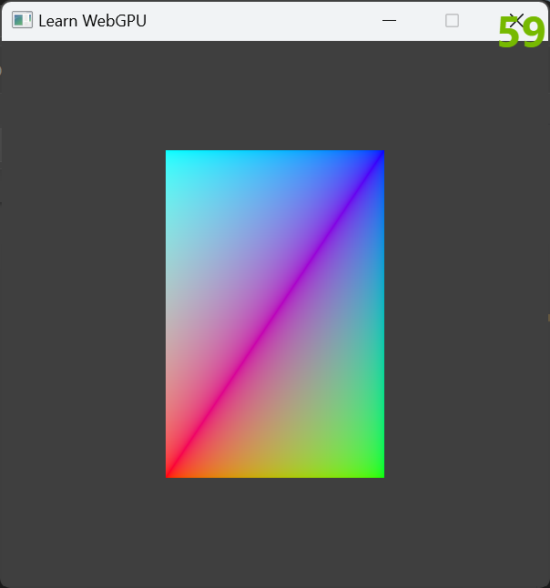

Examples from learning WebGPU    

Rectangle with Index Buffer, Color Buffer and Uniform   

Rectangle with Index Buffer, Color Buffer and Uniform   

Rectangle with Index Buffer and Color Buffer   

Rectangle with colors   

Rectangle   

Triangle   
