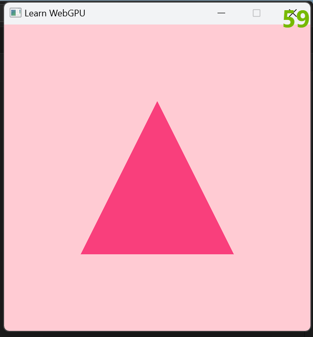

LearnWebGPU   
Step: 10
===========

Render a triangle 


This is a repository of me learning webgpu using  [Learn WebGPU](https://eliemichel.github.io/LearnWebGPU) web book.


Building
--------

```
cmake webgpu
```

```
cmake . -B build
cmake --build build 
```

Run on Windows  `build\Debug\App.exe`   
Run on (linux/macOS/WinGW) `./build/App`